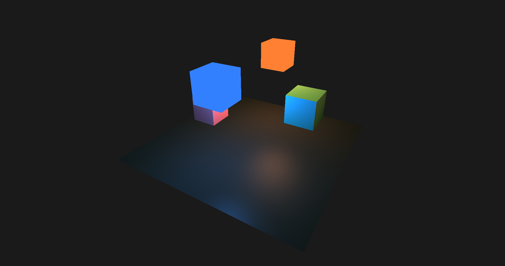

# RenderCore (v1.0)

_A minimal 3D rendering engine built with C++ and OpenGL._

> ⚡ Lightweight. Modular. Educational.  
> This project was created to explore game-engine architecture, ECS, rendering, and real-time graphics.

---

## 📸 Preview




---

## 🎯 Project Overview

It is a small, from-scratch 3D engine built for learning purposes.  
The goal is to understand how a real engine works internally — how models are loaded, how ECS is structured, how rendering pipelines work, and how lighting is implemented.

This release represents a **complete, stable version** of the engine, with all planned core systems implemented.

---

## 🚀 Features (v1.0)

### 🔷 Rendering

- OBJ model loading
- Modular shader system
- Resource system (shader/model caching)
- Uniform Buffers
- Basic materials and rendering parameters

---

### 🔷 Lighting System

Fully functional lighting with multiple sources of each type:

- **Directional Light**
- **Point Light**
- **Spot Light**

All lights are controllable through ECS components.

---

### 🔷 Entity Component System (ECS)

Custom ECS implementation:

- `EntityManager`
- `ComponentManager`
- `SystemManager`
- `ComponentArray<T>`
- `Coordinator` (main ECS interface)

Designed to be simple, clean, and fast.

---

### 🔷 Scene System

- `SceneManager` for switching between multiple scenes
- Independent scene initialization

---

### 🔷 Serialization

Full JSON serialization/deserialization of:

- Transforms
- Models
- Lights
- Scene data
- And other components

Allows saving/loading complete scenes.

---

## 🛠️ Tech Stack

- **Language:** C++
- **Graphics API:** OpenGL
- **Build System:** CMake
- **Architecture:** ECS

---

## 📌 Project Status

**RenderCore v1.0** is a complete, stable release for its intended scope.  
Rendering, ECS, lighting, scene management, and serialization are fully implemented.  
Future updates may extend features, but this version represents a solid, working engine.

---

## 📁 Repository Structure

/external  
└── external libraries

/include  
├── components - ECS Components  
├── ecs - ECS system  
├── managers - Resource Managers, Scene Manager, Uniforms Manager  
├── render - Mesh and Uniforms structures  
└── systems - ECS Systems

/resources  
└── objects, shaders, scenes, and other assets

/src  
├── managers - implementation of managers  
├── render - implementation of render classes  
└── systems - implementation of ECS Systems

/include/App.h  
/src/App.cpp - main App class

---

## ⚡ Build Instructions

```bash
mkdir build
cd build
cmake ..
make
```

Run the executable from the build directory.
You can change the current scene by keys 1,2...9,0

## ⭐ Final Notes

This engine was created as a personal learning project.
Feel free to explore, fork, or use it as a reference for your own engine experiments.
